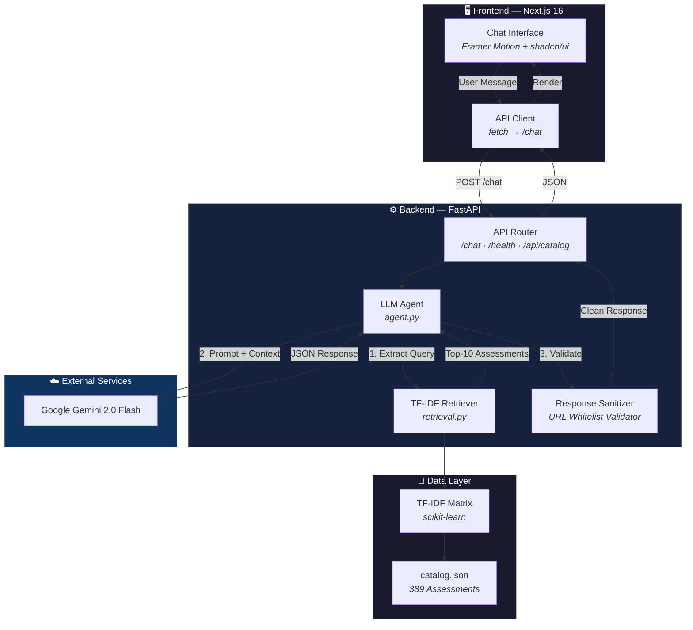
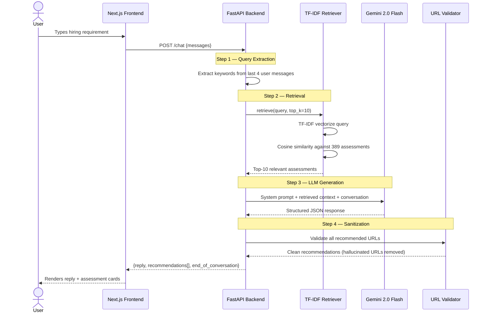
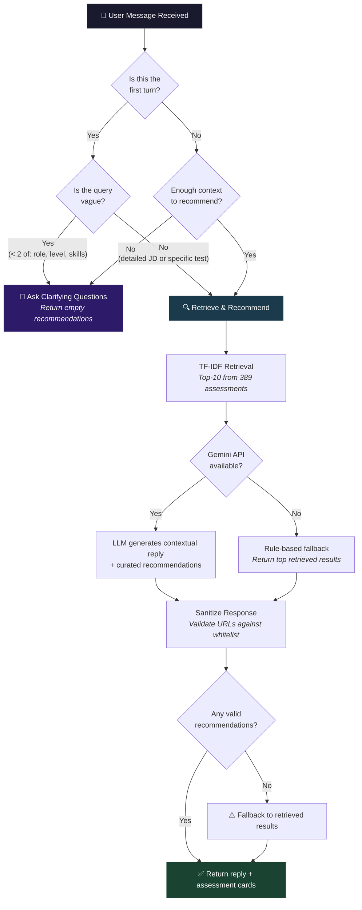
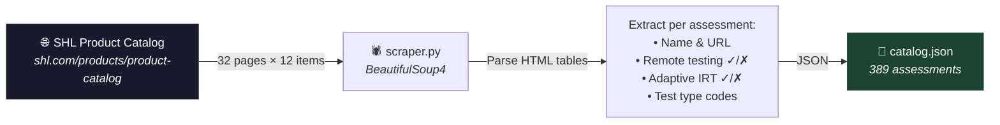
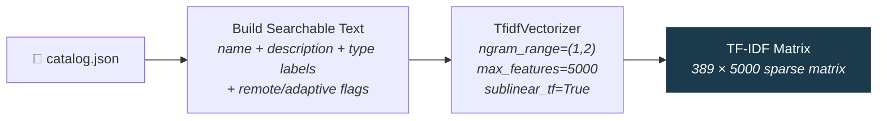
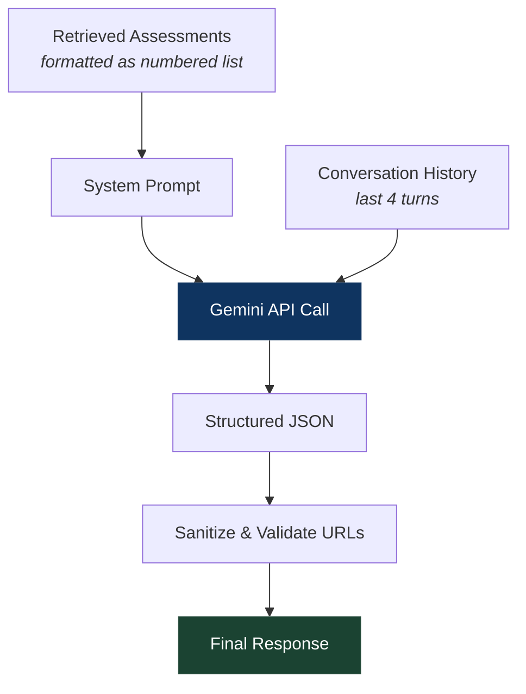
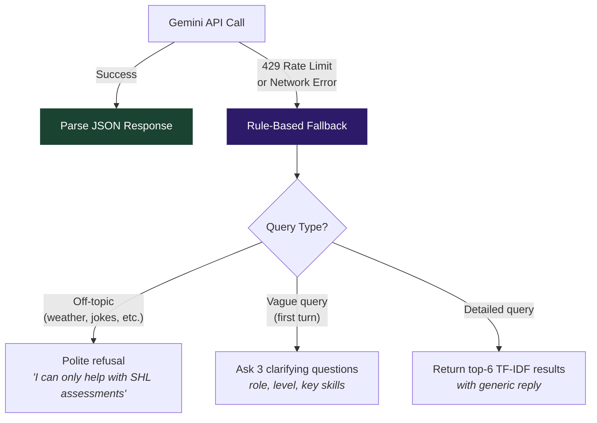
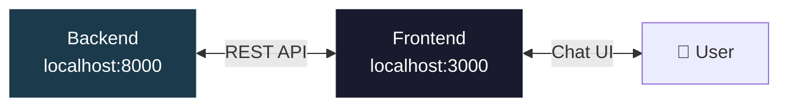

# SHL Assessment Recommender

> **AI-powered conversational assistant** that helps hiring managers find the right SHL Individual Test Solutions from the official product catalog of **389 assessments**.

Built as a full-stack application with a **FastAPI** backend (TF-IDF retrieval + Gemini LLM) and a **Next.js 16** frontend featuring a premium monochromatic dark-mode chat interface.

---

## Table of Contents

- [Live Demo](#live-demo)
- [Architecture Overview](#architecture-overview)
- [System Flow](#system-flow)
- [How It Works — Step by Step](#how-it-works--step-by-step)
- [Tech Stack](#tech-stack)
- [Project Structure](#project-structure)
- [Getting Started](#getting-started)
- [API Reference](#api-reference)
- [Evaluation](#evaluation)
- [Key Behaviors](#key-behaviors)
- [Deployment](#deployment)
- [Screenshots](#screenshots)

---

## Architecture Overview



---

## System Flow

### End-to-End Request Lifecycle



### Conversation Decision Logic



---

## How It Works — Step by Step

### 1. Data Collection — Web Scraper



Each assessment record contains:

```json
{
  "name": "Account Manager Solution",
  "url": "https://www.shl.com/products/product-catalog/view/account-manager-solution/",
  "remote_testing": true,
  "adaptive_irt": true,
  "test_type": ["C", "P", "A", "B"],
  "test_type_labels": ["Competency", "Personality & Behavior", "Ability & Aptitude", "Biodata & SJT"],
  "description": ""
}
```

### 2. Indexing — TF-IDF Vector Space



**Why TF-IDF over embeddings?**
- Zero external API calls at retrieval time
- Sub-millisecond query latency
- No GPU or heavy model dependencies
- Excellent for structured catalog data with distinctive keywords

### 3. Retrieval — Cosine Similarity Search

When a user query arrives:

1. **Query extraction** — Last 4 user messages are concatenated
2. **Vectorization** — Query is transformed using the fitted TF-IDF vectorizer
3. **Similarity** — Cosine similarity computed against all 389 assessment vectors
4. **Ranking** — Top-10 results returned (threshold: score > 0.01)

### 4. LLM Agent — Gemini 2.0 Flash

The agent receives:
- **System prompt** with behavioral rules + retrieved assessment context
- **Conversation history** (last 8 messages / 4 turns)
- **Output format** enforced via `response_mime_type="application/json"`



### 5. Response Sanitization

Every LLM response passes through a sanitizer that:
- ✅ Validates all URLs against the catalog whitelist (389 known URLs)
- ✅ Removes hallucinated URLs that don't exist in the catalog
- ✅ Falls back to raw retrieval results if LLM hallucinated all URLs
- ✅ Caps recommendations at 10 items max
- ✅ Enforces the response schema (reply, recommendations, end_of_conversation)

### 6. Graceful Fallback



---

## Tech Stack

| Layer | Technology | Purpose |
|-------|-----------|---------|
| **Frontend** | Next.js 16 | React framework with App Router |
| | Tailwind CSS v4 | Utility-first styling |
| | shadcn/ui | Accessible UI primitives |
| | Framer Motion | Smooth animations & transitions |
| | Lucide React | Icon system |
| **Backend** | FastAPI | Async Python web framework |
| | scikit-learn | TF-IDF vectorization & cosine similarity |
| | Google GenAI SDK | Gemini 2.0 Flash integration |
| | Pydantic | Request/response validation |
| | python-dotenv | Environment variable management |
| **Data** | BeautifulSoup4 | HTML parsing for catalog scraping |
| | NumPy | Numerical operations |
| **Infra** | Docker | Containerized backend deployment |
| | Uvicorn | ASGI server |

---

## Project Structure

```
SHL-Assignment/
│
├── backend/                    # Python FastAPI backend
│   ├── main.py                 # App entrypoint, routes, CORS
│   ├── agent.py                # LLM agent logic + fallback
│   ├── retrieval.py            # TF-IDF retrieval engine
│   ├── models.py               # Pydantic request/response schemas
│   ├── config.py               # Environment configuration
│   ├── scraper.py              # SHL catalog web scraper
│   ├── evaluate.py             # Recall@10 evaluation script
│   ├── requirements.txt        # Python dependencies
│   ├── .env.example            # Environment variable template
│   └── data/
│       └── catalog.json        # 389 scraped SHL assessments
│
├── frontend/                   # Next.js 16 frontend
│   ├── src/
│   │   ├── app/
│   │   │   ├── layout.tsx      # Root layout with Geist fonts
│   │   │   ├── page.tsx        # Main page with ambient effects
│   │   │   └── globals.css     # Design system & custom animations
│   │   ├── components/
│   │   │   ├── chat-interface.tsx       # Core chat component
│   │   │   ├── welcome-screen.tsx      # Landing screen with suggestions
│   │   │   ├── recommendation-card.tsx # Assessment result cards
│   │   │   ├── typing-indicator.tsx    # Animated loading indicator
│   │   │   └── ui/                     # shadcn/ui primitives
│   │   └── lib/
│   │       ├── api.ts          # Backend API client
│   │       └── utils.ts        # Utility functions
│   ├── package.json
│   └── tsconfig.json
│
├── Dockerfile                  # Backend containerization
├── .gitignore
├── test_gemini.py              # Standalone Gemini API test
└── README.md
```

---

## Getting Started

### Prerequisites

- **Python 3.11+**
- **Node.js 18+** and npm
- **Google Gemini API Key** ([Get one here](https://aistudio.google.com/apikey))

### 1. Clone the Repository

```bash
git clone https://github.com/berserk3142-max/SHL-Assignment.git
cd SHL-Assignment
```

### 2. Backend Setup

```bash
# Install Python dependencies
cd backend
pip install -r requirements.txt
```

Create a `.env` file in the `backend/` directory:

```env
GEMINI_API_KEY=your_gemini_api_key_here
GEMINI_MODEL=gemini-2.0-flash
CORS_ORIGINS=http://localhost:3000
PORT=8000
```

Start the backend server (from the project root):

```bash
cd ..
python -m uvicorn backend.main:app --reload --port 8000
```

### 3. Frontend Setup

```bash
cd frontend
npm install
npm run dev
```

### 4. Open the App

Navigate to **[http://localhost:3000](http://localhost:3000)** — the chat interface will be ready.



---

## API Reference

### `GET /health`

Health check with catalog statistics.

**Response:**
```json
{
  "status": "ok",
  "catalog_size": 389,
  "indexed": true
}
```

### `POST /chat`

Main conversational endpoint.

**Request:**
```json
{
  "messages": [
    { "role": "user", "content": "I need to hire a Java developer" },
    { "role": "assistant", "content": "..." },
    { "role": "user", "content": "Mid-level, needs OOP and testing skills" }
  ]
}
```

**Response:**
```json
{
  "reply": "Based on your requirements for a mid-level Java developer...",
  "recommendations": [
    {
      "name": "Core Java (Advanced Level) (New)",
      "url": "https://www.shl.com/products/product-catalog/view/core-java-advanced-level-new/",
      "test_type": ["K"],
      "duration": null,
      "remote_testing": true,
      "adaptive_irt": false,
      "description": ""
    }
  ],
  "end_of_conversation": false
}
```

### `GET /api/catalog`

Returns the full assessment catalog.

**Response:**
```json
{
  "assessments": [...],
  "total": 389
}
```

---

## Evaluation

The project includes an evaluation script that tests recommendation quality using **Recall@10**.

```bash
python backend/evaluate.py
```

### Test Traces

| # | Scenario | Input | Expected Behavior |
|---|----------|-------|-------------------|
| 1 | Java Developer – Mid Level | Multi-turn: "hire Java dev" → "mid-level, OOP" | Recommend Java assessments |
| 2 | Sales Manager | "Senior sales manager, negotiation & leadership" | Recommend sales-specific tests |
| 3 | Data Analyst – Python | "Data analyst, Python and SQL, entry level" | Recommend Python & SQL tests |
| 4 | Personality for Leadership | "Personality assessments for leadership roles" | Recommend OPQ / leadership personality |
| 5 | Vague Query | "I need an assessment" | Should **clarify**, not recommend |

### Metrics

- **Recall@10**: Fraction of expected assessments found in top-10 predictions
- **Mean Score**: Average recall across all test traces

---

## Key Behaviors

| Behavior | Description |
|----------|-------------|
| 🔄 **Smart Clarification** | Never recommends on turn 1 for vague queries — asks about role, level, and key skills first |
| 🔗 **No Hallucinated URLs** | Every recommended URL is validated against the 389-URL catalog whitelist |
| 🔧 **Mid-Conversation Refinement** | Honors constraint changes (e.g., "actually, make it remote-only") |
| 🚫 **Off-Topic Rejection** | Politely refuses weather, jokes, recipes — stays on SHL assessments |
| 🛡️ **Graceful Fallback** | When Gemini API is unavailable (rate limit, network), falls back to rule-based TF-IDF retrieval |
| 📊 **Capped Context** | Conversation window limited to last 8 messages (4 turns) for efficiency |
| 🎯 **Max 10 Recommendations** | Responses are capped at 10 assessment cards |

---

## Assessment Type Codes

| Code | Full Name | Description |
|------|-----------|-------------|
| **A** | Ability & Aptitude | Cognitive ability, verbal/numerical reasoning |
| **B** | Biodata & SJT | Situational judgment, biographical data |
| **C** | Competency | Competency-based evaluations |
| **D** | Development & 360 | Development reports, 360° feedback |
| **E** | Assessment Exercises | Practical exercises and simulations |
| **K** | Knowledge & Skills | Domain-specific knowledge tests |
| **P** | Personality & Behavior | Personality profiling (e.g., OPQ) |
| **S** | Simulations | Interactive work simulations |

---

## Deployment

### Docker (Backend)

```bash
docker build -t shl-backend .
docker run -p 8000:8000 -e GEMINI_API_KEY=your_key shl-backend
```

### Render / Railway

- **Backend**: Deploy as Web Service using the `Dockerfile`
- **Frontend**: Deploy as a Static Site or Node.js service
  ```bash
  cd frontend && npm run build
  ```
- Set `GEMINI_API_KEY` as an environment variable in the deployment dashboard

---

## Design Philosophy

The frontend follows an **AETHER-inspired** monochromatic design system:

- ⬛ Pure black (`#0a0a0a`) background with subtle white radial glows
- 🔲 Glassmorphic cards with `backdrop-blur` and `border: white/6%`
- ✨ Sparkles icon for AI identity — replacing traditional colored avatars
- ⬜ White send button & user message bubbles for high contrast
- 🔤 Geist font family with tight tracking (`-0.02em` to `-0.04em`)
- 🎬 Framer Motion entrance animations with spring easing

---

## License

This project was built as part of an SHL assignment submission.
